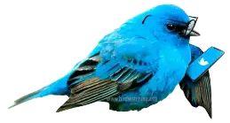
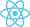
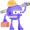

# A BLUE BIRD 

## TLDR

Where I rapidly practice patterns w high value, reverse engineer and implement solutions used in large-scale systems, and sharpen my mental models.

## CLIENT 

- Bootstrapped w `npm create vite@latest a-blue-bird -- --template react-ts`
- How to setup? `npm i` (last using Node v20.10.0)
- How to run? `npm run dev`

## SERVER 

- TODO

\- Johnny
